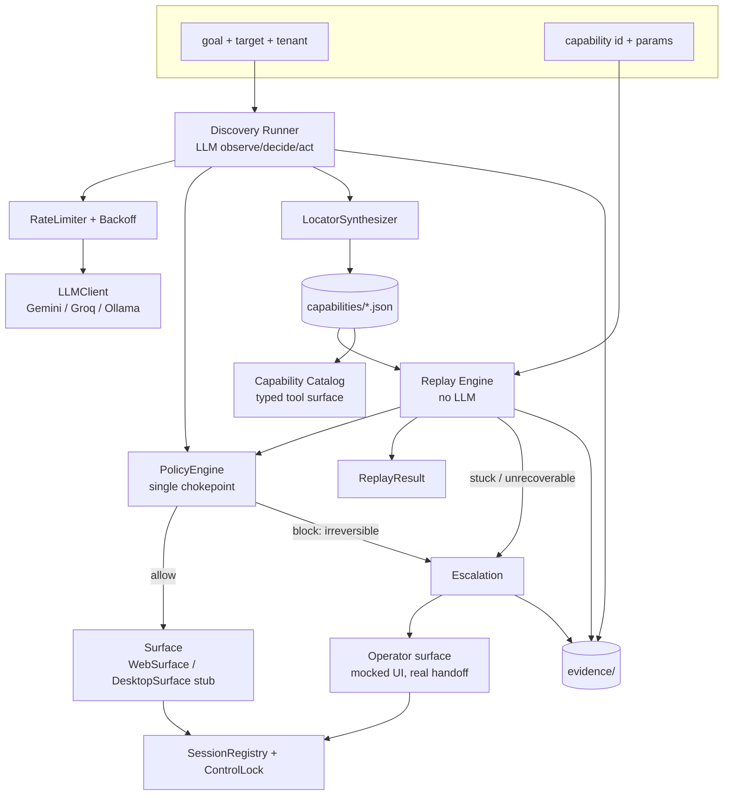

# Technical & Architecture Document
## Computer-Use Automation System — interface.ai take-home

**Owner:** Aditi Kala
**Constraint:** zero-cost. No paid API, no paid hosting, no credit card.
**Status:** Draft for review
**Free-tier facts verified:** September 2026

---

## 0. The zero-dollar bill of materials

| Layer | Choice | License / tier | Cost |
|---|---|---|---|
| Language / runtime | Python 3.11+ | PSF | $0 |
| Package manager | `uv` | MIT | $0 |
| Typed schema | Pydantic v2 | MIT | $0 |
| Browser automation | Playwright (Python) | Apache 2.0 | $0 |
| Primary LLM | Google AI Studio — Gemini Flash free tier | Free tier, no card | $0 |
| Secondary LLM (text-only passes) | Groq free tier | Free tier, no card | $0 |
| Offline fallback LLM | Ollama + a local vision model | MIT | $0 (needs local RAM) |
| Discovery target app | A third-party open-source back-office app, self-hosted | GPL/AGPL, self-hosted | $0 |
| Fault-injection harness | FastAPI + Jinja2, self-built | MIT | $0 |
| Storage | Local filesystem — JSON artifacts, JSONL logs, SQLite if needed | stdlib | $0 |
| Operator console (mocked) | FastAPI route + static HTML polling a file | MIT | $0 |
| Desktop AX proof | `pyatspi` / `uiautomation` / `atomacos` | OSS | $0 |
| Repo + CI | GitHub public repo, GitHub Actions | Free for public repos | $0 |
| Diagrams | Mermaid in markdown | — | $0 |
| Screen recording | OBS Studio or OS screen recorder | GPL | $0 |
| Secrets | `.env` + `python-dotenv`, gitignored | — | $0 |

**Nothing is deployed.** No cloud, no database service, no queue, no container registry. The entire system runs on one laptop. This is not a compromise forced by budget — the brief explicitly says building scaling infrastructure is not rewarded, so "runs locally, single process, justified" is the correct architecture anyway.

---

## 1. LLM provider strategy under free-tier constraints

### 1.1 Current free-tier reality (verified Sept 2026)

- **Google AI Studio (Gemini):** free tier is Flash-only — the Pro models moved behind billing around May 2026. Roughly 10–15 requests/minute and ~1,500 requests/day depending on model. No credit card required. Multimodal (accepts images) and supports function calling. Google revises these limits without notice and cut them substantially in late 2025, so treat the numbers as ballpark and check AI Studio for live figures.
- **Critical trap:** enabling billing on a Gemini project *deletes* that project's free tier entirely — every call bills from the first token, even calls that would have fit the free quota. Keep this project on a billing-disabled project. If a paid project is ever needed, use a separate Google Cloud project.
- **Groq:** ~30 requests/minute free, OpenAI-compatible API, no card. Open-weights models, very fast. Weaker/absent vision on the free models.
- **All no-card free tiers are funded by your prompts** — providers generally train on free-tier inputs and outputs.

### 1.2 Design consequences

**D1 — Vision on the primary loop, text on the auxiliary passes.**
The discovery loop needs screenshots as a secondary observation channel, so it runs on Gemini Flash. The outcome-proposal pass reads a recorded flow and emits candidate detectors — pure text, no images — so it runs on Groq, preserving Gemini quota. This is a free-tier optimisation that happens to also be a clean separation of concerns.

**D2 — A rate limiter is a required component, not a nicety.**
At ~15 RPM, a 25-step discovery run cannot fire requests as fast as the loop can produce them. Ship a token-bucket limiter in front of every LLM call plus exponential backoff (1s → 2s → 4s → 8s) on HTTP 429. Distinguish the two 429 flavours: RPM/TPM exhaustion clears in seconds; RPD exhaustion does not clear until the daily reset and must fail the run with a clear message rather than retrying for hours.

**D3 — Aggressive observation pruning.**
The TPM ceiling is the binding constraint on a large AX tree. Before sending an observation: drop non-interactive nodes with no accessible name, collapse repeated table rows beyond the first N, strip style/presentation nodes, and truncate long text values. Emit the pruning ratio into the run log — it is also evidence of engineering judgment.

**D4 — The free tier trains on your prompts, so the safety story must be real.**
Synthetic data only. No real PII, no real credentials, no real institution names, ever — not because a policy document says so but because the prompts leave your machine and are retained. This is a genuine data-handling decision, it is exactly the kind of reasoning the brief's safety section asks for, and it belongs in `REPORT.md` as a stated constraint rather than a limitation to hide.

**D5 — The free tier validates the project's core thesis.**
Deterministic replay uses zero model calls. Under a 1,500 requests/day ceiling, record-once/replay-many is not an efficiency argument, it is the only way the system runs at all. Say this in the report: the economic argument for the artifact is demonstrated, not asserted.

**D6 — Provider abstraction, not provider lock-in.**

```python
class LLMClient(Protocol):
    def complete(self, messages: list[Message],
                 tools: list[ToolSpec] | None,
                 images: list[bytes] | None) -> LLMResponse: ...
```

Implementations: `GeminiClient`, `GroqClient`, `OllamaClient`. Selected by env var. The Ollama path exists so development continues when the daily quota is gone — it will not produce a good discovery run, and that is fine, because it exists for iterating on plumbing, not for producing evidence.

### 1.3 Quota budget for the project

| Consumer | Calls per run | Runs needed | Total |
|---|---|---|---|
| Discovery loop | ~15–25 | ~15 (including failed attempts) | ~350 |
| Outcome-proposal pass | 1–3 | ~8 | ~25 (on Groq) |
| Replay | **0** | ~40 | **0** |
| Stability ×10 | **0** | 1 | **0** |

Comfortably inside a single day's free quota, with room for a dozen failed attempts. Cost is genuinely not a constraint on this project; rate *limits* mildly are.

---

## 2. Target surface strategy — the free and non-rigged answer

The tension in earlier drafts was: a self-built hostile app lets you inject failures, but you end up designing the exam you then pass.

**Resolution: three surfaces, all free, each with one job.**

| Surface | What it is | Job | Why |
|---|---|---|---|
| **A. Third-party OSS back-office app, self-hosted** | An open-source CRM/ERP/admin app run locally (candidates: Dolibarr, SuiteCRM, osTicket, Odoo Community) | **Discovery runs and the primary evidence** | Not built by you, so no rigged-exam objection. Genuinely table-heavy PHP/server-rendered markup with generated IDs and no test IDs — close to the legacy feel the brief describes. Self-hosted, so no terms-of-service risk, no rate limits, no real data, and you can seed synthetic records freely. |
| **B. Fault-injection harness** | ~200 lines of FastAPI + Jinja2 | **Error-path evidence only** | Query-param flags produce `not_found`, `permission_denied`, `session_timeout`, `surprise_modal`, `slow_load` on demand. No public app will do this. It is a failure generator, not a legacy simulation, so it stays small. |
| **C. Harness variant `tenant-b`** | Same app, rebranded, two renamed labels, one reordered column, a bumped version string | **Cross-tenant overlay evidence** | Proves the shape of base-plus-overlay resolution. One evening. |

This is strictly better than the earlier "public demo site" plan: same credibility benefit, zero terms-of-service exposure, zero network flakiness, and full control over seeded data. Self-hosting a third-party app costs an hour with Docker or a PHP dev server.

**Say all of this explicitly in the README**, including that the automation gets no privileged hooks, no injected test IDs, and no special endpoints on any of the three surfaces.

---

## 3. System architecture



### 3.1 Architectural constraints

**C1 — the session outlives the run.** Requirement 3.6 says a human takes control of *the same live session*. A script that launches and closes its own browser cannot satisfy that at any price. Runs *attach* to a session held by `SessionRegistry`; they never own the browser. This is decided first because retrofitting it means rewriting the executor.

**C2 — one action chokepoint.** Every action from every source passes `PolicyEngine.check()` before touching a surface. Prompt-level guardrails are not guardrails; a model that can talk itself past a rule was never constrained by it.

**C3 — no surface-specific locator is ever a primary strategy.** DOM hints are permitted only as a terminal fallback, flagged `surface_specific: true`, and skipped by any non-web resolver. This is the seam that makes the desktop story credible.

**C4 — replay makes zero model calls.** Enforced structurally: `ReplayEngine` has no `LLMClient` dependency in its constructor. Not a convention — a type-level guarantee.

### 3.2 Process model

Single Python process, three entry points:

```
uv run cua discover --goal "..." --target <url> --tenant tenant-a
uv run cua replay   --capability member.balance.lookup --params '{"member_id":"12345"}'
uv run cua operator          # serves the mocked operator surface on localhost
```

`SessionRegistry` holds headful browsers keyed by session id. Sessions survive across `discover` and `replay` invocations within a run group so the handoff demo is real.

No queue, no worker pool, no service split. Justified in the report: the brief explicitly does not reward scaling infrastructure, and every requirement is satisfiable in-process.

---

## 4. Module design

```
src/
  surfaces/
    base.py          Surface protocol: observe() -> Observation, act(Action) -> ActionResult
    web.py           WebSurface — Playwright, AX tree primary, screenshot secondary
    desktop.py       DesktopSurface — interface only, raises NotImplementedError
    pruning.py       AX tree reduction (D3)
  session/
    registry.py      SessionRegistry — long-lived headful browsers
    lock.py          ControlLock — holder: automation | human | none
  policy/
    engine.py        PolicyEngine.check() — the chokepoint
    rules.py         allowlist + risk classification table
    redaction.py     log/artifact filter
  llm/
    base.py          LLMClient protocol
    gemini.py        primary, vision + tool calling
    groq.py          secondary, text-only passes
    ollama.py        offline fallback
    limiter.py       token bucket + exponential backoff, 429 discrimination
  discovery/
    runner.py        observe -> decide -> act loop, stopping conditions
    tools.py         closed action tool schema
    prompts.py
  recording/
    synthesizer.py   LocatorSynthesizer — candidate generation + uniqueness verification
    outcomes.py      outcome-proposal pass + human approval gate
  schema/
    models.py        Pydantic: Capability, Step, ControlDescriptor, Locator, Outcome, ...
    export.py        JSON Schema export == the agent-facing contract
  replay/
    engine.py        deterministic executor (no LLMClient dependency)
    resolver.py      candidate chain resolution, drift signalling
    conditions.py    Condition evaluation (checkpoints and detectors)
  escalation/
    intervention.py  InterventionRequest
    handoff.py       lock release, human action capture, resume, re-verification
    operator_app.py  mocked console: FastAPI + static HTML
  catalog/
    catalog.py       capability discovery + typed invocation by name
  evidence/
    logger.py        JSONL writer with redaction filter
apps/
  harness/           fault-injection app, tenant-a and tenant-b
capabilities/        saved artifacts + overlays
evidence/
tests/
```

---

## 5. Data model

Full field-level schema is in the PRD; this section covers the parts with architectural weight.

### 5.1 ControlDescriptor — the surface abstraction seam

```python
class ControlDescriptor(BaseModel):
    role: str                     # button, textbox, link, cell, combobox
    name: str | None              # accessible name, if any
    candidates: list[Locator]     # ranked; all verified unique at record time
```

| Strategy | Params | Role |
|---|---|---|
| `role_name` | role, name, match | Strongest where accessible names exist |
| `anchor_relative` | anchor_text, anchor_role, relation (`same_row` / `following` / `within_region`), target_role, index | **Primary strategy for legacy surfaces.** Survives ID churn and reordering. Resolves against a DOM *and* against a desktop AX tree with the same params — that is the whole argument |
| `region_ordinal` | region (heading / landmark / frame path), role, index | Fallback where nothing is named |
| `text_content` | text, match | Brittle to localisation; scored low |
| `dom_hint` | css / xpath | Terminal fallback, `surface_specific: true`, capped at 0.3 |

At record time every candidate is re-resolved against the live page and discarded unless it matches exactly one node. `verified_unique_at_record` is a fact, not an intention.

### 5.2 Outcome — the error taxonomy lives in the schema

```python
class Outcome(BaseModel):
    name: str                                        # "member_not_found"
    kind: Literal["business", "recoverable", "hard_failure"]
    detect: Condition
    applies_to: list[str] | Literal["any"]
    recovery: Recovery | None
    message_template: str
    partial_outputs: list[str]
```

- **business** — a legitimate answer the caller needs. Returns `status="business_outcome"`, never an exception.
- **recoverable** — handled and continued past: dismiss a known interstitial, one bounded retry on a transient load.
- **hard_failure** — stop, capture evidence, return a debuggable error.

The brief names conflating the first and third as the most common design mistake, so the distinction is encoded in the type system rather than in a convention.

### 5.3 ReplayResult — the contract the calling agent sees

```python
class ReplayResult(BaseModel):
    status: Literal["success", "business_outcome", "failure"]
    capability_id: str
    capability_version: str
    run_id: str
    outputs: dict | None
    outcome: OutcomeResult | None
    failure: FailureDetail | None       # step_id, expected, observed,
                                        # candidates_tried, evidence_paths
    steps_executed: int
    duration_ms: int
    locator_usage: dict[str, str]       # control -> strategy that actually fired
    drift_signals: list[str]
```

A caller distinguishes "this member does not exist" from "the automation broke" without parsing a string.

### 5.4 Tenant overlay

```python
class CapabilityOverlay(BaseModel):
    base_capability_id: str
    base_version: str
    tenant_id: str
    overrides: list[Override]           # {step_id, field_path, value}
    added_outcomes: list[Outcome]
    verified_against: str
```

Resolution: load base → apply overrides by JSON path → validate → replay. Reuse is the default; specialisation is additive and auditable. If the base has moved past `verified_against`, the overlay is flagged and unattended replay refused.

**Drift detection is free** because `locator_usage` is already recorded: when a non-primary candidate fires, or a recoverable outcome triggers on a step that never needed it, a drift signal is written. Crossing a threshold demotes the capability to `draft`.

---

## 6. Control flow

### 6.1 Discovery

```
attach session (registry) → acquire lock as automation
loop until goal | 25 steps | timeout | no-progress×3:
    observe()  → AX tree (pruned) + screenshot
    rate limiter → LLM with closed tool schema → exactly one action
    PolicyEngine.check(action)
        blocked & irreversible → escalate
        blocked otherwise      → return refusal to model, continue
    surface.act(action) → log observation hash, reasoning, verdict, result
on success:
    LocatorSynthesizer → candidates per acted-on control, verified
    outcome-proposal pass (Groq) → draft outcomes
    emit Capability(state="draft", outcomes_reviewed=False)
```

### 6.2 Replay

```
load capability (+ overlay) → validate params against schema
attach session → acquire lock
for each step:
    resolve target through candidate chain, record which fired
    PolicyEngine.check
    act
    evaluate outcome detectors:
        business      → return early with partial outputs
        recoverable   → apply recovery, bounded retry
        hard_failure  → capture evidence, return failure
    assert checkpoint; failure with no matching detector → hard_failure
extract declared outputs → validate types → return ReplayResult
```

### 6.3 Escalation and handoff

```
detector fires (no-progress | unrecoverable | blocked irreversible action)
→ write InterventionRequest {run, capability, step, reason, AX snapshot, screenshot ref}
→ ControlLock.release()                      holder: automation -> none
→ operator surface (localhost) displays the request
→ human takes the lock, drives the SAME headful window
→ CDP listener captures clicks / inputs (values redacted) / navigations, per frame,
  re-injected on every navigation
→ human signals resume                        holder: none -> automation
→ replay RE-VERIFIES the current step's checkpoint before continuing
  (it does not assume the human left the app where it expected)
→ human actions appended to the run log, optionally offered as a capability patch
```

**Mocked:** the console UI. **Real:** the lock, the request, same-session control transfer, action capture, resume, post-resume re-verification. The productionised form — containerised browser over noVNC, or a CDP relay behind an auth boundary — is described in the report as the seam, not built.

---

## 7. Safety model

**Allowlist** (`policy.yaml`, global + per capability): permitted domain and route patterns, permitted action types, max steps, max wall clock.

**Risk classification** at the chokepoint:

| Class | Rule | Discovery | Replay |
|---|---|---|---|
| safe | navigate in allowlist, read, extract, type into non-submit fields | allow | allow |
| risky | click submit/save/create | allow, log | allow only if capability `approved` and step was recorded |
| irreversible | target text or route matches delete / transfer / close / disburse / wire, or step declared irreversible | **block → escalate** | **block → escalate** |

Irreversible actions are blocked rather than model-confirmed, because a model that can approve its own risky action is not a control.

**Data handling:**
- Parameters marked `sensitive` are supplied per invocation and never written to artifacts, logs, or stability records.
- A redaction filter sits on the log writer: declared sensitive values plus pattern matches for account-, SSN-, and card-shaped strings → `[REDACTED:param_name]`.
- **Screenshots default to off.** A failure screenshot of a servicing screen is full PII and OCR-based redaction is not happening in this budget. Default capture is an AX snapshot; screenshots require `--allow-screenshots` and are written only to `/evidence/` against synthetic targets. This is a capture-policy answer to a problem we are not solving technically, and the report says so plainly.
- **Free-tier disclosure (D4).** Prompts leave the machine and are retained by the provider. Synthetic data only. Documented as a constraint of the zero-cost stack, which is itself a defensible engineering trade-off to present.

---

## 8. Testing and verification

- **Unit:** locator candidate generation and ranking, condition evaluation, policy rule table, redaction filter, overlay resolution by JSON path.
- **Contract:** every saved artifact validates against the exported JSON Schema in CI.
- **Integration:** replay against the harness with each failure flag, asserting the correct `status` and `outcome.kind` — this is where the error taxonomy is actually proven.
- **Structural:** a test asserting `ReplayEngine` has no `LLMClient` in its dependency graph (C4).
- **Stability:** replay ×10, reporting pass rate and the distribution of which locator strategy fired per control. This converts "replay is deterministic" from a claim into a measurement, and it is close to free.
- **CI:** GitHub Actions on the public repo — lint, types, unit and contract tests. No LLM calls in CI, so no secrets in CI.
- **Manual verification:** end-to-end flows driven in a real browser before evidence is captured.

---

## 9. Runbook

```bash
# one-time
uv sync
uv run playwright install chromium
cp .env.example .env          # GEMINI_API_KEY, GROQ_API_KEY (both free, no card)
docker compose up -d target   # third-party OSS app, surface A
uv run python -m apps.harness # surfaces B and C

# the demo path
uv run cua discover --goal "look up member 12345 and read their savings balance" \
                    --target http://localhost:8080 --tenant tenant-a
uv run cua review   --capability member.balance.lookup      # approve outcomes
uv run cua replay   --capability member.balance.lookup --params '{"member_id":"12345"}'
uv run cua replay   --capability member.balance.lookup --params '{"member_id":"99999"}'   # business outcome
uv run cua replay   --capability member.balance.lookup --tenant tenant-b --params '{"member_id":"12345"}'
uv run cua stability --capability member.balance.lookup -n 10
uv run cua operator                                          # escalation demo
```

`--offline` replays against recorded fixtures with no network at all, so a reviewer without API keys can still run the deterministic half. That single flag is probably the highest-value thing in the README.

---

## 10. What this stack cannot do, and what that costs

| Limitation | Cause | Mitigation |
|---|---|---|
| No frontier model on the discovery loop | Gemini Pro moved behind billing; free tier is Flash-only | Flash is sufficient for a constrained tool-schema loop on a stable UI. If a run fails from model weakness rather than system design, say so in the report rather than hiding it |
| ~15 RPM ceiling | Free tier | Rate limiter + backoff; discovery is slower, not blocked |
| Prompts are retained and may train the provider's models | No-card free tiers are funded this way | Synthetic data only; documented as a safety decision |
| No hosted operator console | No paid hosting | Localhost FastAPI; the brief puts the console out of scope anyway |
| No desktop implementation | Time, not money | Interface + a twenty-line AX dump against one native app |
| No cross-machine session sharing | No hosted browser infra | Handoff demo is single-machine; the productionised transport is designed, not built |

None of these are budget compromises that weaken the submission. The one genuine cost of going free is model quality on the discovery loop, and on a stable enterprise-style UI with a closed action schema that is an acceptable trade.

---

## 11. Open decisions

1. **Which third-party OSS app for surface A?** Needs: server-rendered, table-heavy, generated IDs, a search → detail → action flow, easy local seeding. Dolibarr and SuiteCRM are the leading candidates.
2. Does the desktop AX dump earn a session, or does the interface stub suffice?
3. Screen recording of the handoff: yes or no? (High value, ~30 minutes.)
4. Capability catalog as the single stretch goal, or swap for cross-tenant canonicalisation?
5. Ollama fallback: worth wiring, or is the Groq secondary enough redundancy?